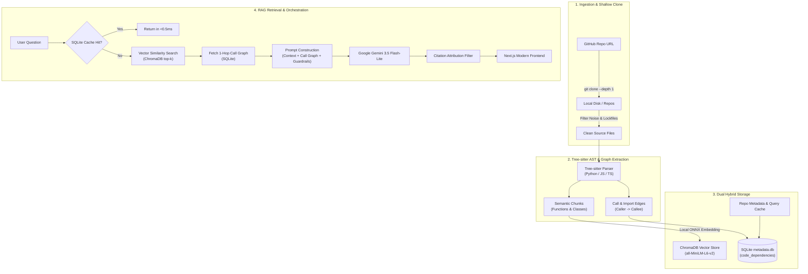

# ⚡ Intelligent Codebase RAG & Graph Query Assistant

> **A production-grade, zero-cost Code Retrieval-Augmented Generation (RAG) and Graph exploration engine.**  
> Ingest any public GitHub repository, parse its Abstract Syntax Tree (AST), extract topological call graphs, and query code with grounded citations in sub-second latency.

---

## 🌟 Key Highlights & Engineering Features

- **💸 100% Free & Self-Contained (Zero Cloud Embedding Costs)**:  
  No paid vector database subscriptions (Pinecone/Weaviate) and zero cloud embedding API limits. Vector embeddings run 100% locally on CPU via ONNX (`all-MiniLM-L6-v2`) inside ChromaDB.
- **🌳 Tree-sitter Semantic AST Chunking**:  
  Traditional RAG naively splits text every $N$ lines, breaking functions in half. This engine parses syntax trees using **Tree-sitter** (supporting Python, JavaScript, and TypeScript) to extract complete function and class boundaries with 1-indexed line fidelity.
- **🕸️ Hybrid GraphRAG (Topological Dependency Mapping)**:  
  Beyond fuzzy vector similarity, the parser extracts directional relationship edges (`CALLS`, `CALLED_BY`, and `IMPORTS`) stored in an indexed SQLite database. Call graph context is injected into LLM prompts to ground reasoning in true architecture.
- **⚡ Sub-Second Retrieval & Generation**:  
  Powered by `gemini-3.5-flash-lite`, generating comprehensive, grounded answers in ~0.9 seconds. Lockfiles (`package-lock.json`, etc.) are intelligently filtered during ingestion, reducing indexing time to under 3 seconds.
- **💾 Multi-User Persistent SQLite Query Cache**:  
  Repeated queries are hashed and served from SQLite in **<0.5ms with 0 Gemini API calls**, completely eliminating rate-limit bottlenecks.
- **🛡️ Strict Zero-Hallucination Guardrails**:  
  Dual-mode toggle (Balanced vs. Strict). Enforces strict citation attribution filtering—citations only appear if the model actively verified and referenced the entity.
- **🎨 Modern Developer UI**:  
  Built with Next.js 16 (App Router) and Tailwind CSS v4. Features an adaptive expanding chat window, slide-out indexed repositories drawer, dark/light modes, and interactive AST dependency chips (`Calls`, `Called by`, `Imports`) linking directly to GitHub line anchors (`#L{start}-L{end}`).

---

## 🏗️ Architecture & Data Flow



---

## 🛠️ Technology Stack

| Layer | Technology | Purpose / Details |
| :--- | :--- | :--- |
| **Frontend UI** | Next.js 16 (App Router), React 19, TypeScript | High-performance server/client architecture with Turbopack |
| **Styling** | Tailwind CSS v4, Lucide Icons | Dark/light theme, glassmorphism, responsive dynamic layout |
| **Backend API** | FastAPI (Python 3.10+), Uvicorn | Async ASGI REST API with Pydantic schema validation & Swagger docs |
| **Code Parser** | Tree-sitter (`python`, `javascript`, `typescript`) | Language grammar-aware semantic boundary & call extraction |
| **Vector Database** | ChromaDB (Persistent) | Local cosine similarity vector storage |
| **Embedding Model** | ONNX `all-MiniLM-L6-v2` | CPU-optimized local embeddings (zero API cost, zero rate limits) |
| **Relational / Graph** | SQLite3 (`metadata.db`) | Catalog, query cache, and indexed AST dependency edges |
| **Reasoning LLM** | Google Gemini 3.5 Flash-Lite | Fast, grounded generation via Google GenAI SDK |

---

## 📁 Repository Structure

```text
├── backend/
│   ├── data/                 # Local data storage (Git ignored)
│   │   ├── chroma_db/        # ChromaDB persistent vector database
│   │   ├── metadata.db       # SQLite DB: repos, cache, code_dependencies
│   │   └── repos/            # Shallow cloned GitHub repositories
│   ├── src/
│   │   ├── config.py         # Paths, model selection, environment loader
│   │   ├── db.py             # SQLite schema, query cache, GraphRAG CRUD
│   │   ├── indexer.py        # ChromaDB embedding & AST dependency coordinator
│   │   ├── ingestion.py      # Git shallow clone & file/noise filtering
│   │   ├── parser.py         # Tree-sitter AST parser, call & import extractors
│   │   └── rag_engine.py     # Intent routing, GraphRAG prompt builder, citation filter
│   ├── main.py               # FastAPI REST server & OpenAPI documentation
│   └── requirements.txt      # Python dependencies for production deployment
│
├── frontend/
│   ├── src/
│   │   ├── app/
│   │   │   ├── layout.tsx    # Root layout, fonts, and dark mode setup
│   │   │   ├── globals.css   # Tailwind v4 styles & theme variables
│   │   │   └── page.tsx      # Main dashboard orchestrator
│   │   ├── components/
│   │   │   ├── Navbar.tsx        # Top navigation with drawer trigger & status indicator
│   │   │   ├── RepoInput.tsx     # Ingestion card with GitHub URL input
│   │   │   ├── Sidebar.tsx       # Slide-out drawer listing indexed repositories
│   │   │   ├── ChatWindow.tsx    # Expanding interactive chat container
│   │   │   ├── CitationCard.tsx  # AST Call Graph chips (Calls, Called-by, Imports)
│   │   │   ├── TechStackModal.tsx# Architecture & stack modal
│   │   │   ├── StrictToggle.tsx  # Zero-hallucination mode toggle
│   │   │   └── ThemeToggle.tsx   # Light/dark mode switcher
│   │   └── services/
│   │       └── api.ts            # Type-safe REST API client (supports NEXT_PUBLIC_API_URL)
│   ├── package.json
│   └── tsconfig.json
│
├── .gitignore                # Comprehensive ignore rules for data, keys & artifacts
└── README.md                 # Project documentation
```

---

## 🚀 Getting Started Locally

### Prerequisites
- **Python**: 3.10 or higher
- **Node.js**: 18.x or higher (with npm)
- **Git**: Installed and available in PATH
- **Google Gemini API Key**: Free tier from [Google AI Studio](https://aistudio.google.com/)

---

### 1. Backend Setup

1. Open a terminal and navigate to the backend:
   ```bash
   cd backend
   ```

2. Create a virtual environment and activate it:
   ```bash
   # Windows (PowerShell)
   python -m venv venv
   .\venv\Scripts\Activate.ps1

   # macOS / Linux
   python3 -m venv venv
   source venv/bin/activate
   ```

3. Install dependencies:
   ```bash
   pip install -r requirements.txt
   ```

4. Create your `.env` file in the `backend/` folder:
   ```env
   GOOGLE_API_KEY=your_gemini_api_key_here
   ```

5. Run the server:
   ```bash
   python main.py
   ```
   * The API starts at `http://localhost:8000`
   * Interactive Swagger documentation: `http://localhost:8000/docs`

---

### 2. Frontend Setup

1. In a new terminal, navigate to the frontend:
   ```bash
   cd frontend
   ```

2. Install dependencies:
   ```bash
   npm install
   ```

3. Start the Next.js development server:
   ```bash
   npm run dev
   ```

4. Open your browser at **`http://localhost:3000`**.

---

## 🌐 Production Deployment

This project is architected for seamless separation of concerns:

### Backend on Render (Web Service)
1. Push this repository to GitHub.
2. Create a new **Web Service** on [Render](https://render.com).
3. Settings:
   - **Root Directory**: `backend`
   - **Runtime**: `Python 3`
   - **Build Command**: `pip install -r requirements.txt`
   - **Start Command**: `uvicorn main:app --host 0.0.0.0 --port $PORT`
4. In **Environment Variables**, add:
   - `GOOGLE_API_KEY`: *(Your Google AI Studio key)*
5. Deploy and copy your backend URL (e.g., `https://code-query-backend.onrender.com`).

### Frontend on Vercel
1. Import your GitHub repository on [Vercel](https://vercel.com).
2. Set the **Root Directory** to `frontend`.
3. In **Environment Variables**, add:
   - `NEXT_PUBLIC_API_URL`: `https://code-query-backend.onrender.com`
4. Click **Deploy**.

---

## 📡 API Reference

### `GET /api/health`
Health check to verify service status.
```json
{
  "status": "healthy",
  "service": "codebase-rag-backend"
}
```

### `GET /api/repos`
Lists all repositories currently indexed in the local SQLite catalog.

### `POST /api/index`
Clones, parses AST, extracts dependency graph, and creates vector embeddings for a GitHub repo.
```json
// Request Body
{
  "repo_url": "https://github.com/psf/requests"
}
```

### `POST /api/query`
Queries an indexed repository using hybrid semantic search and call graph context.
```json
// Request Body
{
  "repo_name": "psf_requests",
  "question": "Where is Session.send defined and what calls it?",
  "strict_mode": false,
  "top_k": 8
}
```

---

## 📄 License
MIT License. Feel free to use, modify, and distribute this project.
