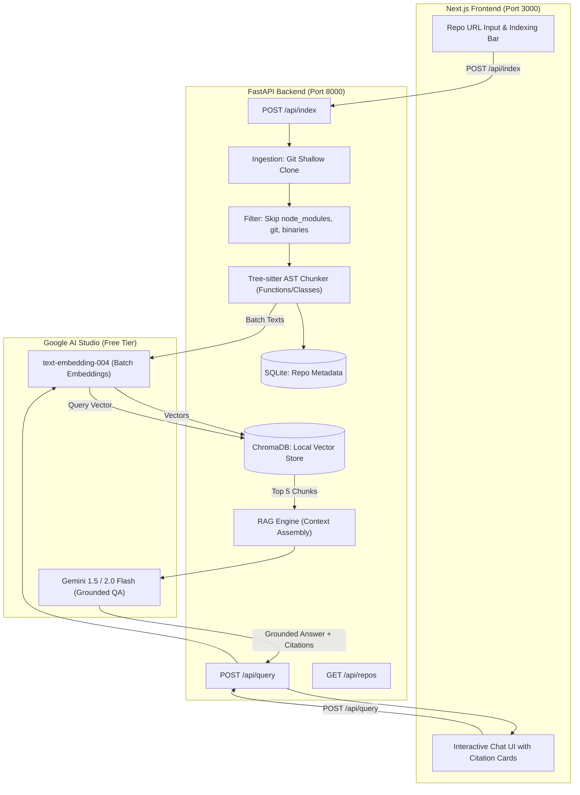

# Code RAG System Implementation Plan (FastAPI + Next.js Stack)

A production-grade, decoupled full-stack Retrieval-Augmented Generation (RAG) system for querying GitHub codebases with grounded, cited responses.

---

## 1. System Architecture & Flow



---

## 2. Prerequisites to Prepare Before Starting

Since we are building a modern decoupled full-stack application, you will need two runtime environments installed on your machine:

1. **Python 3.11 or 3.12** (For the AI & Backend):
   - Download the official Windows installer from [python.org](https://www.python.org/downloads/).
   - > [!IMPORTANT]
     > On the very first installation screen, check the box: **"Add Python to PATH"**.
2. **Node.js LTS (v20 or v22)** (For the Next.js Frontend):
   - Download the **LTS installer** from [nodejs.org](https://nodejs.org/).
   - Run the installer with default options. This installs `node` and `npm`.
3. **Git** (Already verified):
   - Git is already present on your system (`git version 2.55.0.windows.5`).
4. **Google AI Studio API Key** (Free Tier):
   - Visit [aistudio.google.com](https://aistudio.google.com/).
   - Sign in and generate a free API key to paste into your backend `.env` file.

---

## 3. Free-Tier Rate Limits & System Safeguards

| Resource | Free-Tier Quota | System Safeguard |
| :--- | :--- | :--- |
| **Embeddings (`text-embedding-004`)** | 1,500 Requests/min | **Batching**: Group 50–100 chunks per embedding request with exponential backoff retry. |
| **Generation (Gemini Flash)** | 15 Requests/min, 1M Tokens/min, 1,500 Requests/day | **Top-5 RAG Context**: Passing only the top 5 chunks keeps token usage per question under ~4,000 tokens, well within limits. |
| **Repo Scale** | Local disk & memory limit | **Smart Filtering**: Discard `.git`, `node_modules`, `dist`, images, binaries, and lockfiles. Cap repositories at 300 code files for initial testing. |
| **Storage (ChromaDB + SQLite)** | Unlimited local storage | Zero cloud subscriptions. Runs completely out of `./backend/data/`. |

---

## 4. Project Directory Structure

```text
rag-codebase-assistant/
├── backend/                       # Python FastAPI Application
│   ├── data/
│   │   ├── repos/                 # Cloned GitHub repositories
│   │   ├── chroma_db/             # Local ChromaDB vector database
│   │   └── metadata.db            # Local SQLite database
│   ├── src/
│   │   ├── __init__.py
│   │   ├── config.py              # Settings & API keys
│   │   ├── ingestion.py           # Git clone & file discovery
│   │   ├── parser.py              # Tree-sitter AST chunker
│   │   ├── db.py                  # SQLite repo registry
│   │   ├── indexer.py             # Batch embedding & ChromaDB storage
│   │   └── rag_engine.py          # Similarity search & Gemini Flash QA
│   ├── main.py                    # FastAPI app & REST endpoints
│   ├── requirements.txt           # Python dependencies
│   └── .env                       # GOOGLE_API_KEY
│
└── frontend/                      # Next.js Application
    ├── src/
    │   ├── app/
    │   │   ├── layout.tsx
    │   │   └── page.tsx           # Main Chat & Dashboard page
    │   ├── components/
    │   │   ├── RepoInput.tsx      # GitHub URL input & index trigger
    │   │   ├── ChatWindow.tsx     # Message feed
    │   │   ├── MessageBubble.tsx  # User & Assistant messages
    │   │   └── CitationCard.tsx   # Expandable code snippets with line numbers
    │   └── services/
    │       └── api.ts             # Calls to FastAPI endpoints
    ├── package.json
    └── tailwind.config.ts / CSS
```

---

## 5. Phased Implementation Roadmap

### Phase 1: Python FastAPI Backend Core

#### Step 1.0: Backend Setup
- Create Python virtual environment (`.venv`).
- Install dependencies: `fastapi`, `uvicorn`, `tree-sitter`, `tree-sitter-python`, `tree-sitter-javascript`, `chromadb`, `google-genai`, `python-dotenv`, `pydantic`.
- Create `.env` file to hold `GOOGLE_API_KEY`.

#### Step 1.1: Ingestion Module (`src/ingestion.py`)
- Clone repos shallowly (`--depth 1`) using Git to save time and bandwidth.
- Implement file-walking filter: keep only code files (`.py`, `.js`, `.ts`, `.go`, `.java`, etc.) while skipping noise (`node_modules`, `.git`, lockfiles, assets).

#### Step 1.2: AST Code Chunker (`src/parser.py`)
- Parse syntax using Tree-sitter.
- Extract functions, methods, and classes as coherent semantic chunks.
- Capture metadata: file path, enclosing class/function name, start line, end line.

#### Step 1.3: SQLite Metadata Store (`src/db.py`)
- Store repository indexing status, URL, name, and total chunks indexed.

#### Step 1.4: Indexer & ChromaDB (`src/indexer.py`)
- Connect to persistent local ChromaDB.
- Batch embed code chunks using Google `text-embedding-004`.
- Store vector embeddings alongside chunk metadata.

#### Step 1.5: RAG Engine (`src/rag_engine.py`)
- Embed incoming user questions.
- Perform cosine similarity search in ChromaDB (retrieve top 5 chunks).
- Construct grounded prompt for Gemini Flash enforcing file and function citations.

#### Step 1.6: FastAPI Application (`main.py`)
- Setup FastAPI with CORS enabled for `http://localhost:3000`.
- Expose endpoints:
  - `POST /api/index`: Start repo indexing and report progress.
  - `POST /api/query`: Accept question, return answer + cited chunks list.
  - `GET /api/repos`: Return list of currently indexed repositories.
- **Milestone Verification**: Test all endpoints interactively in the browser via FastAPI's built-in Swagger UI (`http://localhost:8000/docs`).

---

### Phase 2: Next.js Modern Frontend

#### Step 2.0: Next.js Scaffolding
- Initialize Next.js project inside `./frontend`.
- Configure modern dark-mode styles and typography.

#### Step 2.1: API Service Layer (`frontend/src/services/api.ts`)
- TypeScript client functions to call `http://localhost:8000/api/*`.

#### Step 2.2: Repository Indexer Header (`RepoInput.tsx`)
- Input box for GitHub repository URL.
- "Index Codebase" button with loading spinners and status indicators.

#### Step 2.3: Chat Interface & Citation Components
- `ChatWindow.tsx`: Scrollable conversation feed.
- `MessageBubble.tsx`: Formatted markdown responses from Gemini.
- `CitationCard.tsx`: Collapsible cards displaying cited file paths, function names, line ranges, and syntax-highlighted code chunks.

---

## 6. Verification Plan

1. **Prerequisites Check**: Verify `python --version` and `node -v` run in terminal.
2. **Backend Unit Tests**:
   - Test cloning a tiny public repository (e.g., a sample 2-file Python repo).
   - Test Tree-sitter parsing of functions and classes.
   - Verify ChromaDB creates local vector collections in `./backend/data/chroma_db/`.
3. **Swagger UI Validation**:
   - Run `uvicorn main:app --reload` on port 8000.
   - Open `http://localhost:8000/docs` in your browser.
   - Submit a test query and confirm cited file/function metadata in the JSON response.
4. **End-to-End Integration**:
   - Run both servers concurrently (`uvicorn` on 8000, `npm run dev` on 3000).
   - Index a repository from the Next.js UI, ask a question, and verify the answer and citation cards render seamlessly.
