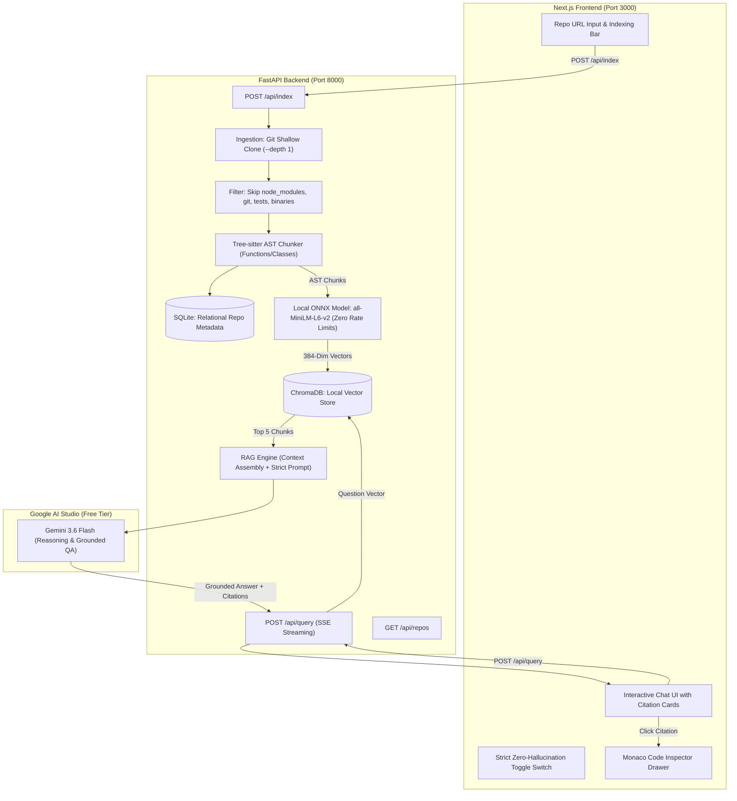

# Code RAG System Implementation Plan (FastAPI + Next.js Stack)

A production-grade, decoupled full-stack Retrieval-Augmented Generation (RAG) system for querying GitHub codebases with grounded, cited responses and strict zero-hallucination guardrails.

---

## 1. System Architecture & Flow



---

## 2. Interview Cheat Sheet & Core Architectural Distinctions

Use this quick-reference guide during technical interviews or project presentations:

| Topic | The Core Concept / Distinction | Why We Chose This Architecture |
| :--- | :--- | :--- |
| **AST Chunking vs. Line Chunking** | Slicing code by fixed lines (e.g. 50 lines) cuts functions in half and ruins logic. Tree-sitter parses the syntax tree to extract complete functions and classes with line numbers. | Preserves complete semantic units (docstrings, parameters, return types) so the AI never sees half-baked code. |
| **Local ONNX vs. Cloud Embedding APIs** | Cloud embedding APIs (like Google's) enforce strict rate limits (100 requests/minute), causing 800-chunk repos to take 8 minutes and crash if multiple users index code simultaneously. | **ChromaDB's local ONNX model (`all-MiniLM-L6-v2`)** runs 100% on the server CPU: embeds 800 chunks in **5 seconds** with **zero rate limits**, zero costs, and multi-user safety. |
| **Polyglot Persistence: SQLite vs. ChromaDB** | ChromaDB is a vector DB (calculates geometric angles between vectors); it is bad at tabular sorting and unique constraints. SQLite is a relational DB. | **Hybrid Storage**: SQLite handles fast repo listings (`SELECT * FROM repositories`), uniqueness, and timestamps; ChromaDB handles semantic nearest-neighbor search. |
| **Native SDK vs. LangChain** | LangChain wraps simple API calls in heavy abstractions, pulling in 50+ background packages and causing complex 40-frame tracebacks when errors occur. | We used the **official Google GenAI SDK** directly. This gives zero framework bloat, lower latency, crystal-clear debugging, and full control over prompt assembly. |
| **REST API vs. FastAPI** | **REST API** is the architectural standard/rulebook (using HTTP `GET`, `POST` with JSON). **FastAPI** is the modern Python tool that builds it. | FastAPI provides automatic Pydantic data validation, high-speed async performance, native token streaming, and automatic interactive Swagger UI documentation (`/docs`). |
| **Balanced Mode vs. Strict Mode** | Standard LLMs either hallucinate or over-refuse greetings. | **Dual Prompt Guardrails**: Balanced Mode answers general questions naturally and cites the codebase when asked about the repo; **Strict Mode** locks the AI into a 100% verified code boundary with mandatory refusal if facts are absent. |

---

## 3. Project Directory Layout

```text
repo-query-assistant/
├── backend/                       # Python FastAPI Application
│   ├── data/
│   │   ├── repos/                 # Cloned GitHub repositories
│   │   ├── chroma_db/             # Local ChromaDB vector database (ONNX)
│   │   └── metadata.db            # Local SQLite database
│   ├── src/
│   │   ├── __init__.py
│   │   ├── config.py              # Settings & API keys (Done!)
│   │   ├── ingestion.py           # Git clone & noise filter (Done!)
│   │   ├── parser.py              # Tree-sitter AST chunker (Done!)
│   │   ├── db.py                  # SQLite repo registry (Done!)
│   │   ├── indexer.py             # Local ONNX ChromaDB indexing (Done!)
│   │   └── rag_engine.py          # Grounded QA & Strict Mode (Done!)
│   ├── test_clone.py              # Ingestion verification script
│   ├── test_parser.py             # AST chunking verification script
│   ├── test_indexer.py            # Local ONNX vector search test script
│   ├── test_rag.py                # Interactive terminal chat test script
│   ├── main.py                    # Step 6: FastAPI REST API & Swagger UI
│   ├── requirements.txt           # Python dependencies
│   └── .env                       # GOOGLE_API_KEY
│
└── frontend/                      # Next.js Application (Phase 2)
    ├── src/
    │   ├── app/
    │   │   ├── layout.tsx
    │   │   └── page.tsx           # Main Chat & Dashboard page
    │   ├── components/
    │   │   ├── RepoInput.tsx      # GitHub URL input & index trigger
    │   │   ├── ChatWindow.tsx     # Message feed with streaming output
    │   │   ├── MessageBubble.tsx  # User & Assistant messages
    │   │   ├── StrictToggle.tsx   # Strict Zero-Hallucination Switch
    │   │   ├── CitationCard.tsx   # Expandable code snippets with line numbers
    │   │   └── CodeDrawer.tsx     # Monaco editor / code inspector side panel
    │   └── services/
    │       └── api.ts             # Calls to FastAPI endpoints
    ├── package.json
    └── tailwind.config.ts / CSS
```

---

## 4. Phased Implementation Roadmap

### Phase 1: Python FastAPI Backend Core

#### Step 1: Ingestion Module (`src/ingestion.py`) — ✅ Completed
* Shallow Git cloning (`--depth 1`) and noise filtering (`.git`, `node_modules`, `tests/`, lockfiles).

#### Step 2: AST Code Chunker (`src/parser.py`) — ✅ Completed
* Tree-sitter AST parser extracts whole functions, methods, and classes along with exact line numbers and metadata.

#### Step 3: SQLite Repository Registry (`src/db.py`) — ✅ Completed
* Stores lightweight repo records (URL, local folder path, total chunks indexed, timestamp).

#### Step 4: Local ONNX Indexer & ChromaDB (`src/indexer.py`) — ✅ Completed
* Embeds code chunks locally via ChromaDB ONNX (`all-MiniLM-L6-v2`) in seconds with zero rate limits and persists them locally.

#### Step 5: Grounded RAG Query Engine (`src/rag_engine.py`) — ✅ Completed
* Native Google GenAI SDK integration with **Gemini 3.6 Flash**.
* Implements Dual-Mode prompt engineering: Balanced Conversational Mode + **Strict Zero-Hallucination Mode**.

#### Step 6: FastAPI REST API (`main.py`) — ⏳ Next Step
* Exposes clean REST endpoints:
  - `POST /api/index`: Ingests and indexes a GitHub repo.
  - `GET /api/repos`: Lists all indexed repositories.
  - `POST /api/query`: Accepts question + `strict_mode` flag, returns answer + citations.
* Enables interactive browser testing via Swagger UI (`http://localhost:8000/docs`).

---

### Phase 2: Next.js Modern Frontend

#### Step 7: Next.js Scaffolding & Setup
* Scaffold Next.js project with modern dark-mode styling.

#### Step 8: API Client & State Management
* Build `services/api.ts` to communicate with the FastAPI backend asynchronously.

#### Step 9: Interactive UI Components
* **Repo Bar**: URL input, "Index Codebase" button with loading status.
* **Strict Mode Switch**: Sleek toggle for Zero-Hallucination mode.
* **Chat Window**: Interactive conversational message feed.
* **Citation Cards**: Collapsible code snippets with syntax highlighting, file paths, and line badges.

---

### Phase 3: Zero-Cost Deployment

#### Step 10: Deploy Frontend to Vercel
* Connect GitHub repo to Vercel (free tier, instant global CDN).

#### Step 11: Deploy Backend to Render / Railway
* Deploy FastAPI backend container with pre-warmed ONNX embedding cache.

---

### Phase 4: Advanced Capstone Enhancements (Post-Deployment)

1. **Hybrid Search (BM25 Keyword + Dense Vector with Reciprocal Rank Fusion / RRF)**.
2. **Real-Time Token Streaming (Server-Sent Events / SSE)** for ChatGPT-style word-by-word typing.
3. **Interactive Code Inspector Drawer with GitHub Deep Links** to jump straight to exact lines on GitHub.com.
4. **Automated RAG Hallucination & Faithfulness Metric** for numerical reliability scoring.
