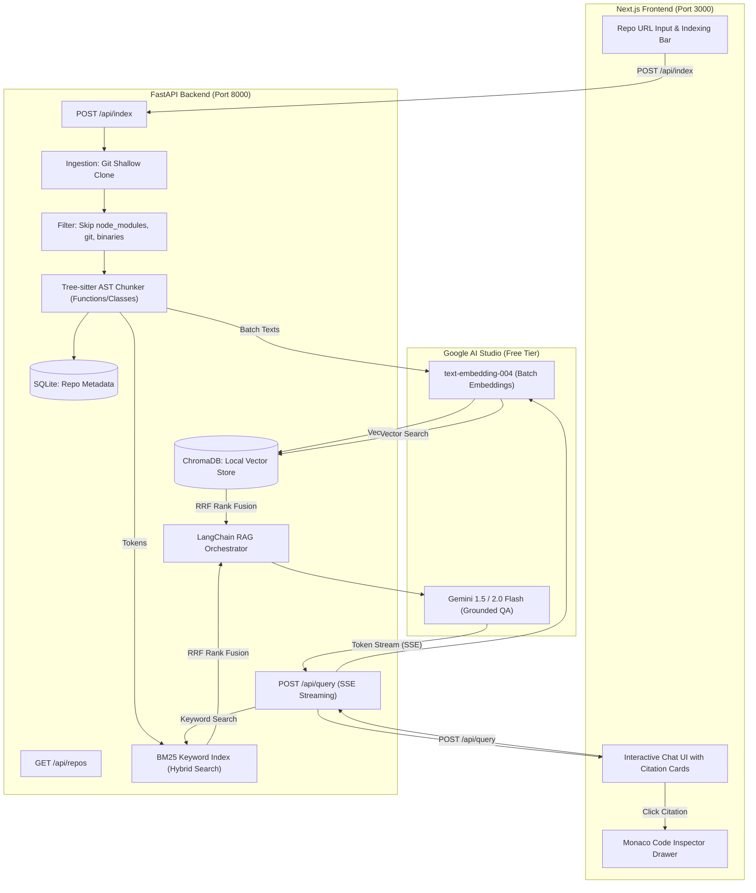

# Code RAG System Implementation Plan (FastAPI + Next.js Stack)

A production-grade, decoupled full-stack Retrieval-Augmented Generation (RAG) system for querying GitHub codebases with grounded, cited responses.

---

## 1. System Architecture & Flow



---

## 2. Prerequisites & Environment Setup

All runtime dependencies are verified and available:
* **Python 3.11+ / 3.14**: Runs the AI, LangChain, and FastAPI backend.
* **Node.js LTS (v24)**: Runs the Next.js modern frontend.
* **Git**: Handles shallow repository cloning.
* **Google AI Studio Key**: Free API key from [aistudio.google.com](https://aistudio.google.com/) for embeddings and Gemini Flash.

---

## 3. Free-Tier Quotas & System Safeguards

| Resource | Free-Tier Limit | Built-in Safeguard |
| :--- | :--- | :--- |
| **Embeddings (`text-embedding-004`)** | 1,500 Requests/min | **Batching**: Group 50–100 code chunks per API call instead of one by one. Exponential backoff retry logic. |
| **Generation (Gemini Flash)** | 15 Requests/min, 1M Tokens/min, 1,500 Requests/day | **Top-5 Context Retrieval**: Passing only the top 5 chunks keeps prompt size under ~4,000 tokens, far below the 1M token/min limit. |
| **Repo Scale** | Local disk & RAM | **Smart Filtering**: Automatically exclude `.git`, `node_modules`, `dist`, images, binaries, and lockfiles. Cap repositories at 300 code files with a warning. |
| **Storage (ChromaDB + SQLite)** | Unlimited local storage | Runs 100% locally on your machine at zero cost inside `backend/data/`. |

---

## 4. Project Directory Layout

```text
repo-query-assistant/
├── backend/                       # Python FastAPI Application
│   ├── data/
│   │   ├── repos/                 # Cloned GitHub repositories
│   │   ├── chroma_db/             # Local ChromaDB vector database
│   │   └── metadata.db            # Local SQLite database
│   ├── src/
│   │   ├── __init__.py
│   │   ├── config.py              # Settings & API keys
│   │   ├── ingestion.py           # Git clone & file discovery (Done!)
│   │   ├── parser.py              # Tree-sitter AST chunker (Done!)
│   │   ├── db.py                  # SQLite repo registry
│   │   ├── indexer.py             # Batch embedding & ChromaDB storage
│   │   ├── hybrid_search.py       # BM25 + Vector Reciprocal Rank Fusion
│   │   └── rag_engine.py          # LangChain orchestration & Gemini Flash QA
│   ├── main.py                    # FastAPI app & REST endpoints
│   ├── requirements.txt           # Python dependencies
│   └── .env                       # GOOGLE_API_KEY
│
└── frontend/                      # Next.js Application
    ├── src/
    │   ├── app/
    │   │   ├── layout.tsx
    │   │   └── page.tsx           # Main Chat & Dashboard page
    │   ├── components/
    │   │   ├── RepoInput.tsx      # GitHub URL input & index trigger
    │   │   ├── ChatWindow.tsx     # Message feed with streaming output
    │   │   ├── MessageBubble.tsx  # User & Assistant messages
    │   │   ├── CitationCard.tsx   # Expandable code snippets with line numbers
    │   │   └── CodeDrawer.tsx     # Full Monaco editor / code inspector side panel
    │   └── services/
    │       └── api.ts             # Calls to FastAPI endpoints
    ├── package.json
    └── tailwind.config.ts / CSS
```

---

## 5. Phased Implementation Roadmap

### Phase 1: Python FastAPI Backend Core

#### Step 1: Ingestion Module (`src/ingestion.py`) — ✅ Completed & Verified
* Clones repos shallowly (`git clone --depth 1`) and filters out clutter (`node_modules`, `.git`, lockfiles, images).

#### Step 2: AST Code Chunker (`src/parser.py`) — ✅ Completed & Verified
* Tree-sitter AST parser extracts whole functions, methods, and classes along with exact line numbers and metadata.

#### Step 3: SQLite Repository Registry (`src/db.py`)
* Stores lightweight repo records (URL, local folder path, total chunks indexed, timestamp).

#### Step 4: Batch Embeddings & ChromaDB Storage (`src/indexer.py`)
* Batches extracted code chunks, sends them to Google `text-embedding-004` to generate 768-dim vectors, and persists them into local ChromaDB.

#### Step 5: LangChain RAG Query Engine (`src/rag_engine.py`)
* **LangChain Orchestration**: Uses LangChain's `PromptTemplate`, `Document` schema, and `ChatGoogleGenerativeAI` to build a clean chain.
* Retrieves top 5 most similar chunks from ChromaDB, formats the augmented prompt, and enforces exact file/function citations.

#### Step 6: FastAPI REST API (`main.py`)
* Exposes endpoints (`POST /api/index`, `POST /api/query`, `GET /api/repos`) with CORS support and Swagger documentation (`http://localhost:8000/docs`).

---

### Phase 2: Next.js Modern Frontend

#### Step 7: Next.js Scaffolding & Setup
* Scaffold the Next.js app in `/frontend` with modern dark mode styling.

#### Step 8: API Client & State Management
* Build `services/api.ts` to communicate with the FastAPI backend asynchronously.

#### Step 9: UI Components
* **Repo Bar**: URL input, "Index Codebase" button with loading status.
* **Chat Window**: Interactive conversational message feed.
* **Citation Cards**: Collapsible code snippets with syntax highlighting, file paths, and line badges.

---

### Phase 3: Zero-Cost Deployment

#### Step 10: Deploy Frontend to Vercel
* Connect your GitHub repo to Vercel (free tier, instant global CDN deployment).

#### Step 11: Deploy Backend to Render / Railway
* Deploy the FastAPI backend service using Render or Railway's free tier with environment variable configuration.

---

### Phase 4: Advanced Capstone Enhancements (Post-Deployment)

These 4 high-signal features will elevate this project from a standard prototype into a standout portfolio capstone:

#### Feature 4.1: Hybrid Search (BM25 Keyword + Dense Vector with RRF)
* **What it is**: Dense vectors excel at conceptual meaning, but struggle with exact variable names (e.g., `JWT_SECRET`). BM25 excels at exact keywords.
* **Implementation**: We combine BM25 scoring with ChromaDB cosine distance using **Reciprocal Rank Fusion (RRF)** to deliver state-of-the-art retrieval accuracy.

#### Feature 4.2: Real-Time Token Streaming (Server-Sent Events)
* **What it is**: Instead of waiting 5 seconds for a response to finish, tokens stream onto the screen word-by-word via FastAPI `StreamingResponse` and EventSource in Next.js.

#### Feature 4.3: Interactive Code Inspector Drawer with GitHub Deep Links
* **What it is**: Clicking any citation opens a sleek slide-out drawer featuring a full syntax-highlighted code viewer and an instant **"Open lines X-Y on GitHub"** direct link.

#### Feature 4.4: Automated RAG Hallucination & Faithfulness Metric
* **What it is**: A built-in evaluation function that checks if every statement generated by the LLM is directly supported by the retrieved code, outputting a numerical Faithfulness Score.

---

## 6. Verification & Milestone Testing Plan

1. **Step 1 Verification**: `python backend/test_clone.py` (Confirmed).
2. **Step 2 Verification**: `python backend/test_parser.py` (Confirmed).
3. **Step 3 & 4 Verification**: Embed test chunks into ChromaDB and query them to verify vector search returns expected code.
4. **Step 5 Verification**: Ask a sample question via CLI and verify LangChain + Gemini Flash returns a cited response.
5. **Step 6 Verification**: Launch `uvicorn main:app --reload` and test all endpoints via FastAPI's interactive Swagger UI at `http://localhost:8000/docs`.
6. **Step 7–9 Verification**: Launch `npm run dev` and test full end-to-end question answering in the Next.js browser interface.
7. **Post-Deployment Verification**: Validate live Vercel frontend communicating with the deployed FastAPI backend.
