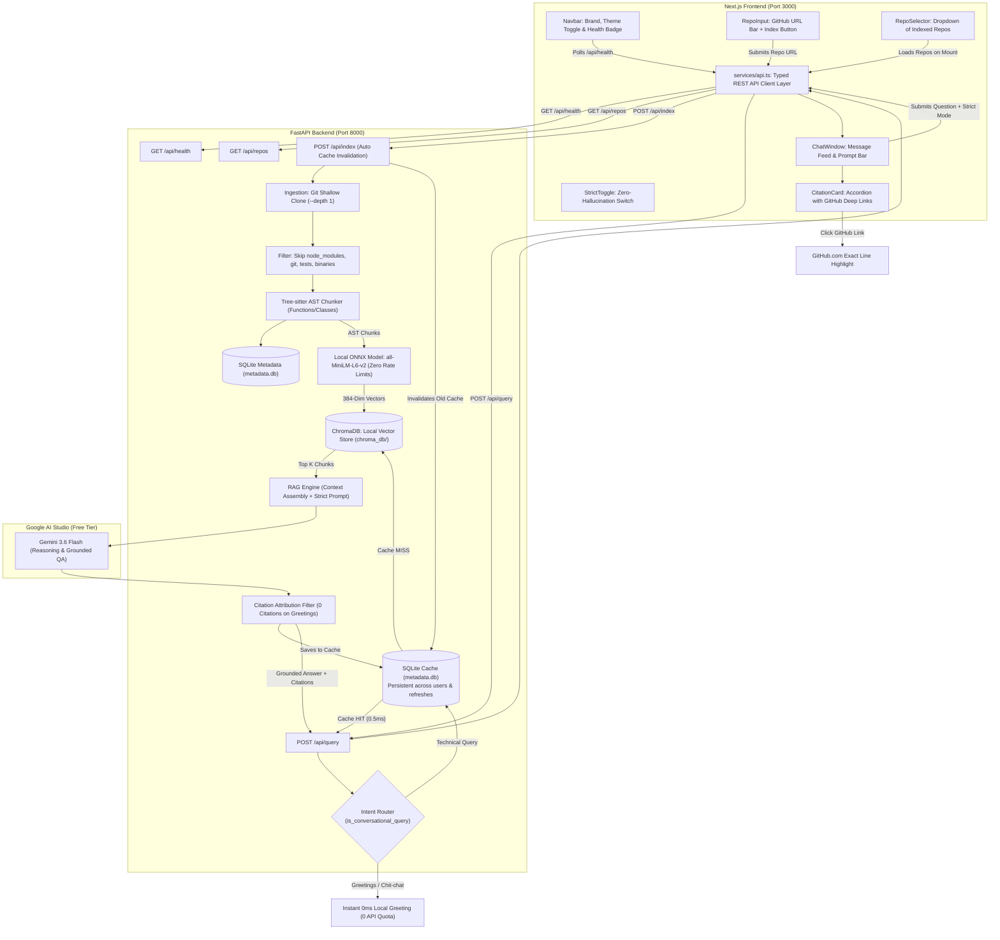

# Intelligent Code Query Engine Implementation Plan (FastAPI + Next.js Stack)

A production-grade, decoupled full-stack Retrieval-Augmented Generation (RAG) system for querying GitHub codebases with grounded, cited responses, direct GitHub line permalinks, persistent multi-user SQLite caching, and strict zero-hallucination guardrails.

---

## 1. System Architecture & Flow



---

## 2. Frontend-Backend Interaction Map & Data Contracts

This section defines **every single touchpoint** where the Next.js React frontend communicates with the FastAPI Python backend.

### The 4 Core Interaction Points:

| # | Frontend Component | User Action | HTTP Method & Endpoint | Request Payload (JSON) | Backend Response (JSON) | Frontend State Updated |
|---|---|---|---|---|---|---|
| **1** | `Navbar.tsx` | Page loads (mount) | `GET /api/health` | *(None)* | `{"status": "healthy", "service": "codebase-rag-backend"}` | `isBackendOnline: true` (Displays green pulsating indicator) |
| **2** | `RepoSelector.tsx` | Page loads or after new index | `GET /api/repos` | *(None)* | `{"count": 1, "repositories": [{"repo_name": "psf_requests", "repo_url": "...", "total_chunks": 812, "indexed_at": "..."}]}` | `repositories: RepoMetadata[]`, `selectedRepo: string` (Populates dropdown) |
| **3** | `RepoInput.tsx` | User types GitHub URL & clicks "Index Repo" | `POST /api/index` | `{"repo_url": "https://github.com/psf/requests"}` | `{"status": "success", "message": "...", "stats": {"repo_name": "psf_requests", "total_chunks": 812, "duration_seconds": 6.2}}` | `isIndexing: false`, triggers `fetchRepos()` to refresh dropdown, clears old repo cache in SQLite |
| **4** | `ChatWindow.tsx` & `StrictToggle.tsx` | User types question & clicks "Send" (or presses Enter) | `POST /api/query` | `{"repo_name": "psf_requests", "question": "How do retries work?", "strict_mode": true, "top_k": 5}` | `{"repo_name": "psf_requests", "question": "...", "strict_mode": true, "answer": "...", "citations": [{"file_path": "requests/adapters.py", "entity_name": "send", "start_line": 450, "end_line": 520, "snippet": "...", "github_url": "..."}], "cached": true}` | Appends message to `messages`, renders markdown text, renders `CitationCard` accordion, displays `⚡ Cached (<1ms)` badge |

---

## 3. Interview Cheat Sheet & Core Architectural Distinctions

Use this quick-reference guide during technical interviews or project presentations:

| Topic | The Core Concept / Distinction | Why We Chose This Architecture |
| :--- | :--- | :--- |
| **Multi-User Persistent Cache (SQLite on Disk)** | In-memory RAM caches die on server restart; client-side caches (`localStorage`) are isolated to one user. SQLite disk caching stores precomputed responses on the server. | **0.5ms Response Time**: If User A asks a question, User B (and all future users) get the answer instantly with **0 Gemini API calls**, completely shielding the system from the free-tier 15 RPM limit. |
| **Instant 0ms Greeting Routing** | Calling LLMs for greetings wastes 2–3 seconds of network latency and burns scarce API rate limits. | Pure conversational pleasantries (`"hi"`, `"what?"`, `"thanks"`) are answered instantly locally in Python (<0.001s) with 0 citations and 0 quota consumed. |
| **Cache Invalidation Strategy** | Caches must never serve stale code answers after code changes. | When `POST /api/index` is called to re-index a repo, `clear_repo_cache(repo_name)` automatically wipes cached answers for that specific repo. |
| **GitHub Deep Linking (#L{start}-L{end})** | Rather than just displaying plain code text, the backend resolves the repository's GitHub origin URL and constructs deterministic GitHub line permalinks (`blob/HEAD/{path}#L{start}-L{end}`). | Allows developers to audit AI answers instantly in the official GitHub UI, view git blames, and see surrounding file context. |
| **REST API vs. FastAPI** | **REST API** is the architectural standard/protocol (using HTTP verbs `GET`, `POST`, `PUT`, `DELETE` with JSON payloads). **FastAPI** is the modern Python ASGI web framework used to implement that standard. | FastAPI provides automatic Pydantic request/response validation, native async performance, and automatic interactive Swagger documentation (`/docs`). |
| **Sync vs. Async** | **Synchronous**: Each request occupies a thread and blocks until I/O (database, disk, API call) finishes. If 10 requests hit a 5-second slow query, threads pile up and server freezes.<br>**Asynchronous**: Non-blocking event loop. When a task waits on network or disk I/O, the event loop pauses that task and serves other incoming requests immediately. | In high-concurrency AI applications where LLM responses take 2–5 seconds, async ensures the backend can serve hundreds of concurrent users without thread starvation. |
| **Why Couldn't Django Be Async Historically?** | Django was born in 2005 around **WSGI** (Web Server Gateway Interface), which is inherently synchronous and single-request-per-thread. Django's core ORM, middleware, and signals were deeply coupled to synchronous thread-local storage. | While modern Django (v3+) introduced ASGI support, its ORM still requires async-to-sync adapters. FastAPI was engineered from scratch on **ASGI (Starlette + Pydantic)**, making it 300% faster and natively async. |
| **API Client Layer (`services/api.ts`) vs. Scattered `fetch()`** | Scattering raw `fetch("http://localhost:8000/...")` across 10 React components creates duplicated boilerplate, inconsistent error handling, and hardcoded URLs. | Centralizing all calls in `services/api.ts` gives a **single source of truth**, centralized base URL management, unified error interceptors, and strict TypeScript types matching backend Pydantic schemas. |
| **CORS (Cross-Origin Resource Sharing)** | Web browsers enforce the Same-Origin Policy: frontend at `http://localhost:3000` is forbidden from reading responses from `http://localhost:8000` unless the backend explicitly authorizes it. | We configure FastAPI's `CORSMiddleware` with `allow_origins=["*"]` (or port 3000 in production), sending `Access-Control-Allow-Origin` headers that tell the browser the connection is safe. |
| **AST Chunking vs. Line Chunking** | Slicing code by fixed lines (e.g. 50 lines) cuts functions in half and ruins logic. Tree-sitter parses the syntax tree to extract complete functions and classes with line numbers. | Preserves complete semantic units (docstrings, parameters, return types) so the AI never sees half-baked code. |
| **Local ONNX vs. Cloud Embedding APIs** | Cloud embedding APIs (like Google's) enforce strict rate limits (100 requests/minute), causing 800-chunk repos to take 8 minutes and crash if multiple users index code simultaneously. | **ChromaDB's local ONNX model (`all-MiniLM-L6-v2`)** runs 100% on the server CPU: embeds 800 chunks in **5 seconds** with **zero rate limits**, zero costs, and multi-user safety. |
| **Polyglot Persistence: SQLite vs. ChromaDB** | ChromaDB is a vector DB (calculates geometric angles between vectors); it is bad at tabular sorting and unique constraints. SQLite is a relational DB. | **Hybrid Storage**: SQLite handles fast repo listings (`SELECT * FROM repositories`), uniqueness, and timestamps; ChromaDB handles semantic nearest-neighbor search. |
| **Native SDK vs. LangChain** | LangChain wraps simple API calls in heavy abstractions, pulling in 50+ background packages and causing complex 40-frame tracebacks when errors occur. | We used the **official Google GenAI SDK** directly. This gives zero framework bloat, lower latency, crystal-clear debugging, and full control over prompt assembly. |
| **Balanced Mode vs. Strict Mode** | Standard LLMs either hallucinate or over-refuse greetings. | **Dual Prompt Guardrails**: Balanced Mode answers general questions naturally and cites the codebase when asked about the repo; **Strict Mode** locks the AI into a 100% verified code boundary with mandatory refusal if facts are absent. |
| **Dark & Light Mode Architecture** | A professional application should adapt to user preference. Using Tailwind v4 `@custom-variant dark` with local storage persistence provides instantaneous, zero-flash transitions. | Enhances accessibility and developer ergonomics during long coding or debugging sessions. |

---

## 4. Project Directory Layout

```text
repo-query-assistant/
├── backend/                       # Python FastAPI Application
│   ├── data/
│   │   ├── repos/                 # Cloned GitHub repositories
│   │   ├── chroma_db/             # Local ChromaDB vector database (ONNX)
│   │   └── metadata.db            # Local SQLite database (Repos + Query Cache)
│   ├── src/
│   │   ├── __init__.py
│   │   ├── config.py              # Settings & API keys (Done!)
│   │   ├── ingestion.py           # Git clone & noise filter (Done!)
│   │   ├── parser.py              # Tree-sitter AST chunker (Done!)
│   │   ├── db.py                  # SQLite repo registry & query cache (Done!)
│   │   ├── indexer.py             # Local ONNX ChromaDB indexing (Done!)
│   │   └── rag_engine.py          # Grounded QA, Intent Router & Cache check (Done!)
│   ├── test_clone.py              # Ingestion verification script
│   ├── test_parser.py             # AST chunking verification script
│   ├── test_indexer.py            # Local ONNX vector search test script
│   ├── test_rag.py                # Interactive terminal chat test script
│   ├── main.py                    # FastAPI REST API with GitHub Deep Links & Cache (Done!)
│   ├── requirements.txt           # Python dependencies
│   └── .env                       # GOOGLE_API_KEY
│
└── frontend/                      # Next.js Application (Phase 2)
    ├── src/
    │   ├── app/
    │   │   ├── layout.tsx         # Global layout & metadata (Done!)
    │   │   ├── globals.css        # Tailwind styling & dark-mode variant (Done!)
    │   │   └── page.tsx           # Main Dashboard orchestration page (Done!)
    │   ├── components/
    │   │   ├── Navbar.tsx         # Branding, Health Indicator & Theme Toggle (Done!)
    │   │   ├── ThemeToggle.tsx    # Sun/Moon Dark & Light Mode Switch (Done!)
    │   │   ├── RepoInput.tsx      # GitHub URL input & index trigger button (Done!)
    │   │   ├── RepoSelector.tsx   # Dropdown to choose active indexed codebase (Done!)
    │   │   ├── StrictToggle.tsx   # Strict Zero-Hallucination mode switch (Done!)
    │   │   ├── ChatWindow.tsx     # Message feed with cached badges & prompt input (Done!)
    │   └── CitationCard.tsx   # Expandable code snippets with GitHub Permalinks (Done!)
    │   └── services/
    │       └── api.ts             # Typed REST API Client for FastAPI backend (Done!)
    ├── package.json
    └── tsconfig.json
```

---

## 5. Phased Implementation Roadmap

### Phase 1: Python FastAPI Backend Core
- **Step 1: Ingestion Module (`src/ingestion.py`)** — ✅ Completed
- **Step 2: AST Code Chunker (`src/parser.py`)** — ✅ Completed
- **Step 3: SQLite Repository Registry & Cache (`src/db.py`)** — ✅ Completed
- **Step 4: Local ONNX Indexer & ChromaDB (`src/indexer.py`)** — ✅ Completed
- **Step 5: Grounded RAG Query Engine with Intent Router (`src/rag_engine.py`)** — ✅ Completed
- **Step 6: FastAPI REST API Gateway (`main.py`)** — ✅ Completed

---

### Phase 2: Next.js Modern Frontend
- **Step 7: Next.js Scaffolding & Setup** — ✅ Completed
- **Step 8: Typed API Client Layer (`services/api.ts`)** — ✅ Completed
- **Step 9: UI Components Construction** — ✅ Completed
  - `Navbar.tsx`: Live backend connectivity badge (`GET /api/health`).
  - `ThemeToggle.tsx`: Dark / Light theme switcher with `localStorage` persistence.
  - `RepoInput.tsx`: Clean GitHub repository cloner bar with loading animation (`POST /api/index`).
  - `RepoSelector.tsx`: Dropdown showing all indexed repos in SQLite (`GET /api/repos`).
  - `StrictToggle.tsx`: Pill toggle switch for Strict Zero-Hallucination Mode.
  - `CitationCard.tsx`: Collapsible drawer with file paths, line ranges, and GitHub deep links.
  - `ChatWindow.tsx`: Real-time chat feed with Markdown rendering, cached badges, and user input (`POST /api/query`).
- **Step 10: Page Integration (`app/page.tsx`)** — ✅ Completed
  - Wired state, theme classes, and component callbacks together in `page.tsx`.

---

### Phase 3: Verification & Zero-Cost Deployment
- **Step 11: End-to-End Local Verification** — ⏳ Next Step
  - Test greetings (`"hi"`, `"what?"`) for instant 0ms responses.
  - Test asking the same question twice to verify the `⚡ Cached (<1ms)` badge.
- **Step 12: Deploy Frontend to Vercel** (Free global edge CDN).
- **Step 13: Deploy Backend to Render / Railway** (Free container hosting).
